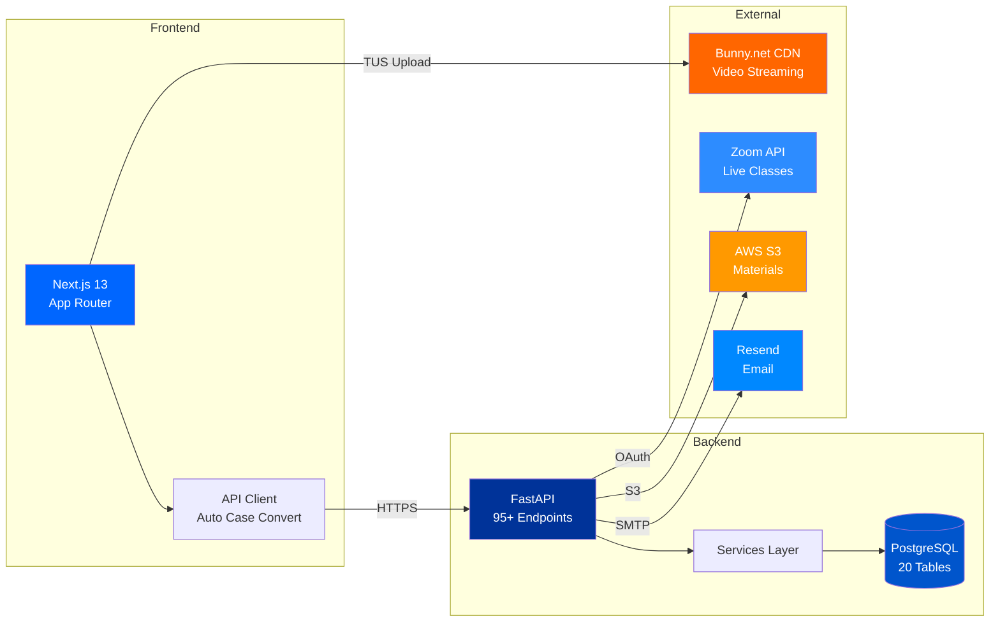
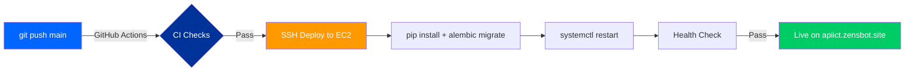

<div align="center">

<!-- Banner -->


<br/>

<!-- Logo & Branding -->
<a href="https://zensbot.com">

</a>

<br/><br/>

<!-- Badges -->


<br/>


<br/><br/>

> **A production-grade Learning Management System built for institutes managing thousands of students, teachers, and courses — with live Zoom classes, video streaming, and real-time collaboration.**

<br/>

</div>

---

<br/>

##  &nbsp; Four Powerful Roles

<table>
<tr>
<td align="center" width="25%">

### 

Manage everything — users, batches, settings, devices, and institute-wide analytics

</td>
<td align="center" width="25%">

### 

Build courses, upload video lectures, manage curriculum, materials, and job postings

</td>
<td align="center" width="25%">

### 

Teach batches, schedule Zoom classes, upload materials, track student progress

</td>
<td align="center" width="25%">

### 

Watch lectures, download materials, join live classes, browse job opportunities

</td>
</tr>
</table>

<br/>

##  &nbsp; Feature Highlights

<table>
<tr>
<td width="50%">

### Video Streaming
```
Bunny.net CDN  ·  TUS Resumable Upload
Parallel Chunked Upload  ·  Auto-Encoding
Signed Token Playback  ·  Progress Tracking
Anti-Piracy Watermark Overlay
```

</td>
<td width="50%">

### Live Classes
```
Zoom Integration  ·  Server-to-Server OAuth
Auto-Recording  ·  Webhook Status Sync
Schedule Management  ·  Recording Playback
```

</td>
</tr>
<tr>
<td width="50%">

### Authentication & Security
```
JWT Access + Refresh Tokens
Device Limit Enforcement
Role-Based Access Control
Soft-Delete Across All Entities
Rate Limiting on Auth Endpoints
```

</td>
<td width="50%">

### Course Management
```
Curriculum Builder  ·  Module Sequencing
Material Upload (S3)  ·  Batch Assignment
Multi-Batch Courses  ·  Student Enrollment
Progress Tracking  ·  Resume Playback
```

</td>
</tr>
</table>

<br/>

##  &nbsp; Architecture



<br/>

##  &nbsp; Tech Stack

<table>
<tr>
<td align="center" width="33%">

### Frontend
<br/>


<br/><br/>

Next.js 13 · TypeScript · Tailwind CSS
Radix UI · Shadcn · Sonner · TUS Client

</td>
<td align="center" width="33%">

### Backend
<br/>


<br/><br/>

FastAPI · SQLModel · PostgreSQL
SQLAlchemy 2.0 · Alembic · Pydantic

</td>
<td align="center" width="33%">

### Infrastructure
<br/>


<br/><br/>

AWS EC2 · Nginx · GitHub Actions
Bunny CDN · Zoom API · Resend

</td>
</tr>
</table>

<br/>

##  &nbsp; Quick Start

<details>
<summary><b>Prerequisites</b></summary>
<br/>

| Tool | Version |
|------|---------|
| Node.js | 18+ |
| Python | 3.11+ |
| PostgreSQL | 14+ |

</details>

<br/>

**1. Clone & Install**
```bash
git clone https://github.com/your-org/ICT_LMS_CUSTOM.git
cd ICT_LMS_CUSTOM
```

<table>
<tr>
<td width="50%">

**Backend**
```bash
cd backend
python -m venv venv
source venv/bin/activate    # Windows: venv\Scripts\activate
pip install -r requirements.txt
cp ../envs/backend.env .env # configure your values
alembic upgrade head
uvicorn app.main:app --reload
```

</td>
<td width="50%">

**Frontend**
```bash
cd frontend
npm install
cp ../envs/frontend.env .env
npm run dev
```

</td>
</tr>
</table>

**2. Open** → [`http://localhost:3000`](http://localhost:3000)

<br/>

##  &nbsp; Project Structure

```
ICT_LMS_CUSTOM/
├── backend/
│   ├── app/
│   │   ├── routers/        # 11 API routers (95+ endpoints)
│   │   ├── services/       # Business logic layer
│   │   ├── models/         # 20 SQLModel tables
│   │   ├── schemas/        # Pydantic DTOs
│   │   ├── middleware/     # JWT auth, role guards
│   │   └── utils/          # Bunny, S3, Zoom, email, security
│   ├── migrations/         # Alembic migrations
│   └── main.py             # App entry point
│
├── frontend/
│   ├── app/                # 33+ pages (Next.js App Router)
│   │   ├── admin/          #   Admin dashboard & management
│   │   ├── course-creator/ #   Course & content management
│   │   ├── teacher/        #   Teaching & class scheduling
│   │   └── student/        #   Learning & video playback
│   ├── components/         # Shared UI components
│   ├── lib/api/            # 11 API modules + client
│   └── hooks/              # useApi, useMutation, usePaginatedApi
│
├── envs/                   # Environment variable templates
└── .github/workflows/      # CI/CD pipeline
```

<br/>

##  &nbsp; API Overview

<table>
<tr>
<td>

| Router | Endpoints | Description |
|--------|:---------:|-------------|
| `auth` | 4 | Login, refresh, logout, session |
| `users` | 8 | CRUD, profile, device management |
| `batches` | 12 | Batches, enrollment, student lists |
| `courses` | 8 | Course CRUD, assignment |
| `curriculum` | 6 | Modules, sequencing, topics |
| `lectures` | 10 | Upload, stream, progress, signed URLs |
| `materials` | 6 | Upload (S3), download, metadata |
| `zoom` | 8 | Classes, schedule, recordings, webhooks |
| `jobs` | 6 | Job postings, applications |
| `announcements` | 6 | Batch announcements, WebSocket |
| `admin` | 15+ | Settings, analytics, system management |

</td>
</tr>
</table>

> All endpoints return `PaginatedResponse<T>` for list operations with server-side pagination.

<br/>

##  &nbsp; Deployment



| Component | URL | Host |
|-----------|-----|------|
| **API** | `https://apiict.zensbot.site` | AWS EC2 (ap-south-1) |
| **Frontend** | `https://zensbot.online` | Vercel |
| **Database** | AWS RDS PostgreSQL | ap-south-1 (Mumbai) |
| **Video CDN** | Bunny.net Stream | Global Edge |

<br/>

##  &nbsp; Security

<table>
<tr>
<td width="50%">

- JWT with 15min access + 7-day refresh tokens
- Automatic token refresh with request deduplication
- Device limit enforcement per user
- Role-based endpoint guards
- Rate limiting (5/min login, 10/min refresh)

</td>
<td width="50%">

- Soft-delete on all 20 tables (audit trail)
- Signed video URLs with time-limited tokens
- Anti-piracy watermark (student email overlay)
- S3 presigned URLs for material downloads
- Encrypted Zoom credentials at rest

</td>
</tr>
</table>

<br/>

---

<div align="center">

<br/>

<a href="https://zensbot.com">

</a>

<br/><br/>


<br/><br/>

**[zensbot.com](https://zensbot.com)** · Built with precision for education

<br/>


</div>
